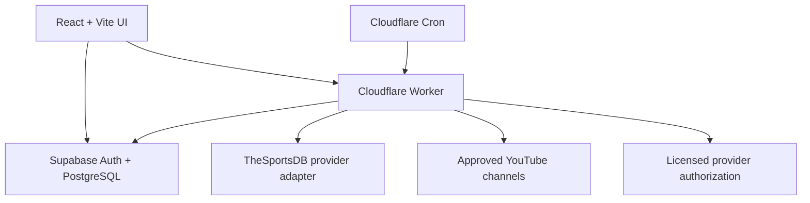

# Live Sports TV

Mobile-first sports discovery and authorized-streaming platform built with React, TypeScript, Supabase and Cloudflare Workers. Public viewing is free: there are no subscriptions, payment tables, pricing routes, paywalls or premium plans.

## What is included

- Live, recent and upcoming match discovery with local-time conversion, countdowns, scores and Realtime refresh.
- Football coverage seeded for Premier League, La Liga, Bundesliga, Ligue 1, Serie A, Saudi Pro League and MLS.
- Cricket catalogue seeded for Bangladesh, India, Pakistan, Sri Lanka, Afghanistan, Australia, England, New Zealand, South Africa, West Indies, Zimbabwe and Ireland.
- Official-source workflow: approved providers, permission evidence, Bangladesh territory checks, rights expiry, confidence scoring, review queue and automatic promotion.
- Players for official YouTube/official embeds, licensed HLS (`hls.js`), licensed DASH/DRM (`Shaka Player`) and official external watch pages.
- Free accounts with Supabase Auth and cross-device favourite matches; anonymous favourites remain on-device.
- Protected WordPress-style admin area for catalogue, matches, providers, streams, discovery, highlights, banners, pages, ads, branding and logs.
- Cloudflare Worker API, five-minute live refresh/discovery Cron, hourly schedule sync, caching, CORS, rate limiting, short-lived playback authorization and playback logging.
- 20-table PostgreSQL schema with RLS on every public table, Realtime, duplicate prevention, URL/domain triggers and administrator audit triggers.
- Bengali and English interface support; site name, logo, favicon, colour, language, notices, social links and footer are database-managed.

## Rights and sourcing boundary

This project never scrapes arbitrary streams, extracts protected manifests, spoofs request headers, bypasses DRM/geoblocks, proxies another broadcaster, or accepts unverified IPTV lists. A source is playable only when all of the following are true:

1. The provider is in `approved_sources`.
2. A permission reference and future rights expiry are present.
3. Bangladesh (`BD`) or `GLOBAL` is permitted.
4. The original page and embed/manifest host match the approved provider domain.
5. The provider and stream are active, and embedding is explicitly allowed when applicable.

If no approved source exists, the UI says: **No official free stream is currently available.**

## Architecture



## Local setup

Requirements: Node.js 20.19 or newer and npm.

```bash
git clone https://github.com/fahimxbdxc/Live-sports.git
cd Live-sports
npm ci
cp .env.example .env.local
```

Set the browser-safe values in `.env.local`:

```dotenv
VITE_SUPABASE_URL=https://your-project.supabase.co
VITE_SUPABASE_PUBLISHABLE_KEY=sb_publishable_your_key
VITE_WORKER_API_URL=http://localhost:8787
```

Then start the web app:

```bash
npm run dev
```

Without Supabase environment values the frontend intentionally uses clearly labelled demo schedules. It never supplies a fake playable stream.

## Supabase setup

The migrations in `supabase/migrations` create the full schema, RLS, triggers, indexes and seed catalogue.

```bash
npx supabase login
npx supabase link --project-ref YOUR_PROJECT_REF
npx supabase db push
```

Create a free account through `/login`, then promote the first trusted administrator once from the Supabase SQL editor:

```sql
update public.profiles
set role = 'admin'
where id = (select id from auth.users where email = 'admin@example.com');
```

All later admin checks are server/RLS verified. Never put a service-role or secret key in a `VITE_` variable.

### Provider catalogue

In `/admin/catalogue`, set each competition's TheSportsDB league ID. The Worker imports only competitions with:

- `external_provider = 'thesportsdb'`
- a non-null `external_id`
- `active = true`

The Worker uses TheSportsDB's official V1 schedule and event-lookup APIs. Replace the adapter in `worker/src/provider.ts` to use API-Sports under a separate provider implementation if preferred.

### Approved sources

Add providers in `/admin/sources`. A source cannot be saved without its provider domain, permission reference, territory, original page and future expiry. Add an official YouTube channel ID for automated discovery. The discovery engine searches only those channel IDs with live, embeddable, syndicated and Bangladesh-region filters. Uncertain results remain in `/admin/discovery`.

## Cloudflare Worker

Copy `worker/.dev.vars.example` to `worker/.dev.vars` for local use. These values are server-only:

```dotenv
SUPABASE_SECRET_KEY=sb_secret_your_server_only_key
SPORTS_API_KEY=your_thesportsdb_key
YOUTUBE_API_KEY=your_youtube_data_api_key
PLAYBACK_AUTH_ENDPOINT=https://licensed-provider.example/authorize
PLAYBACK_AUTH_TOKEN=your_provider_server_token
```

Update `ALLOWED_ORIGINS` and `SUPABASE_URL` in `worker/wrangler.jsonc`, then run:

```bash
npx wrangler dev --config worker/wrangler.jsonc
npx wrangler secret put SUPABASE_SECRET_KEY --config worker/wrangler.jsonc
npx wrangler secret put SPORTS_API_KEY --config worker/wrangler.jsonc
npx wrangler secret put YOUTUBE_API_KEY --config worker/wrangler.jsonc
npx wrangler secret put PLAYBACK_AUTH_ENDPOINT --config worker/wrangler.jsonc
npx wrangler secret put PLAYBACK_AUTH_TOKEN --config worker/wrangler.jsonc
npx wrangler deploy --config worker/wrangler.jsonc
```

`PLAYBACK_AUTH_*` is required only for a contracted HLS/DASH provider. The provider response may include a short-lived `drm_license_url` and supported `drm_key_system`; both URLs must remain under the approved provider domain.

## Cloudflare Pages

Build command: `npm run build`  
Output directory: `dist`

Configure the three public `VITE_*` environment variables in Pages and deploy:

```bash
npm run build
npx wrangler pages deploy dist --project-name live-sports-tv
```

The committed `_redirects` file provides React Router SPA fallback. `_headers` supplies CSP and other browser security headers.

## Verification

```bash
npm run lint
npm run typecheck
npm test
npm run worker:check
npm run worker:dry-run
npm run build
```

Database verification should include Supabase Security Advisor, anonymous reads, user-owned favourites, admin writes, candidate approval/rejection and a rejected off-domain URL. The repository's migration triggers enforce these rules even if a client is modified.

## Operational notes

- Ads are globally disabled by default and each campaign is also saved inactive. The UI never renders raw ad HTML, misleading controls or overlays on the player.
- Demo rows have `is_demo = true` and are visibly labelled.
- API keys and playback credentials stay in Worker secrets.
- The Worker keeps cached schedules available during temporary upstream failures; failures are recorded in `sync_logs`.
- Real provider/channel IDs and rights records are intentionally not seeded. Add them only after authorization is documented.
